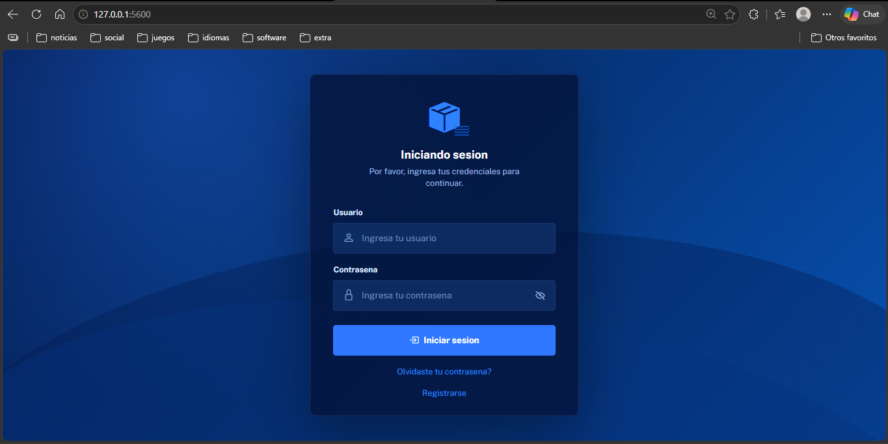
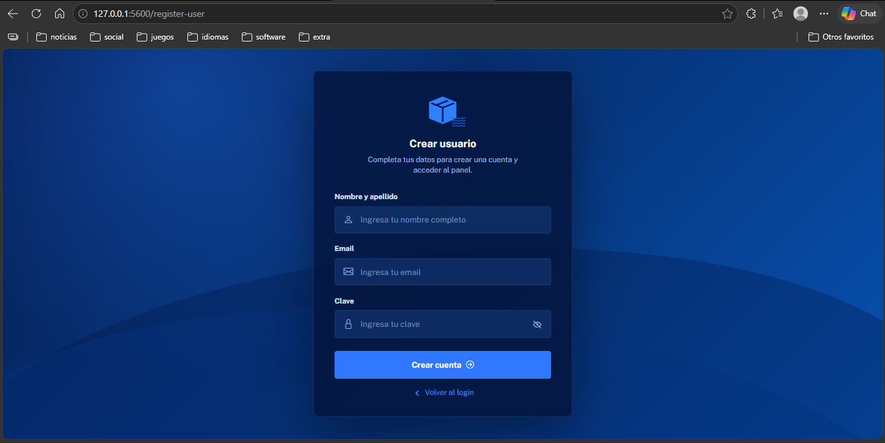
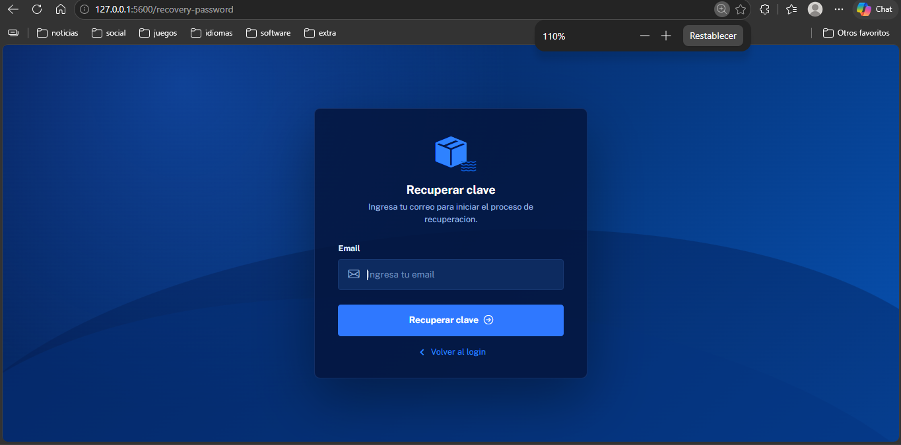
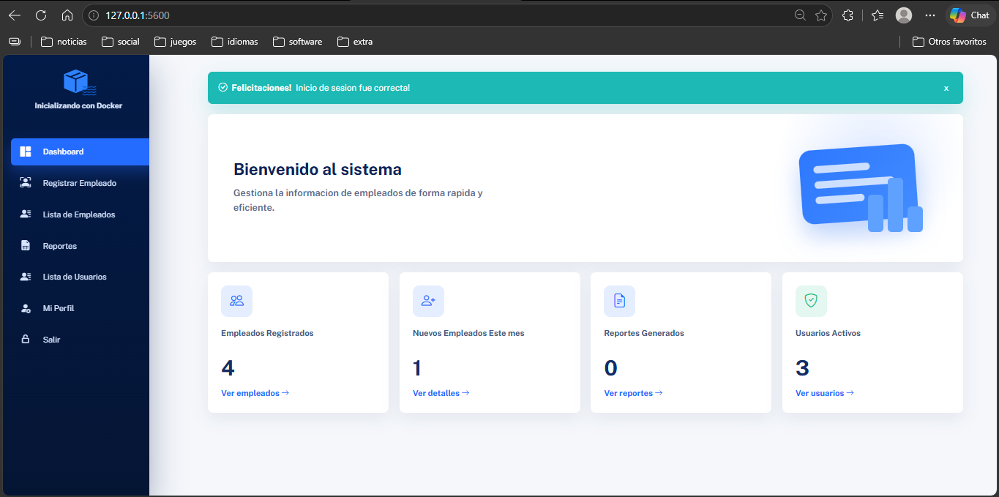
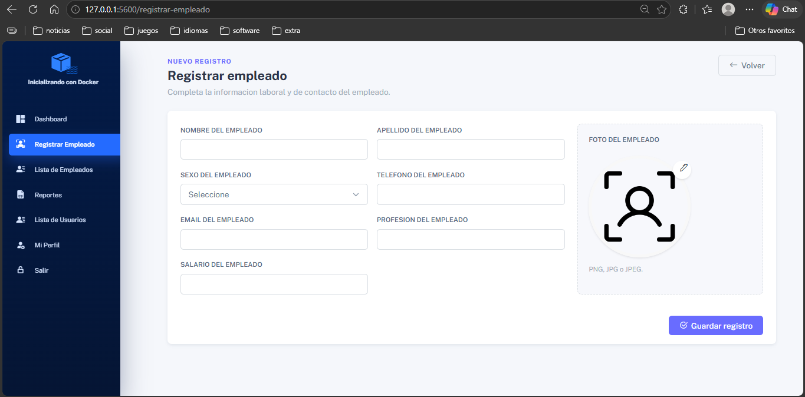
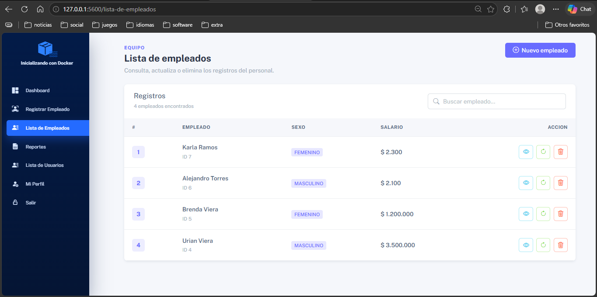
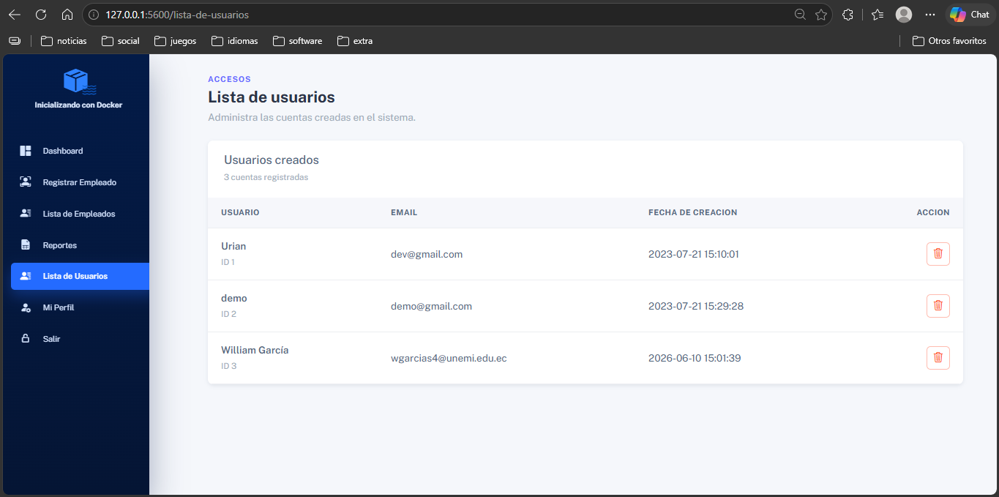
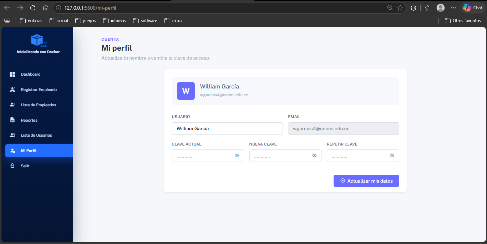
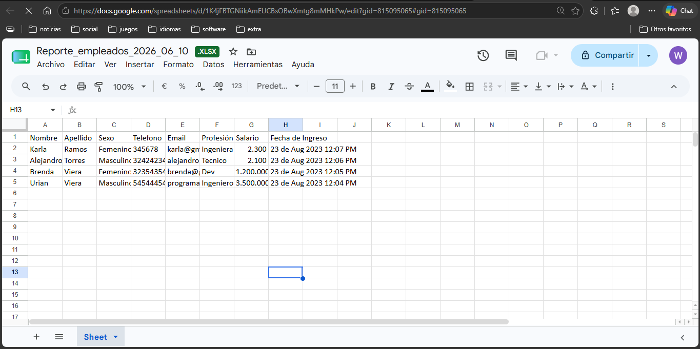

# CRUD con Python 🐍 MySQL 📂 y un Dashboard Asombroso 🚀

Aprende a desarrollar un sistema **CRUD** utilizando **Python 🐍** y **MySQL 📂** mientras creas un impresionante panel de control interactivo. Este proyecto es ideal para quienes buscan gestionar datos de manera eficiente y construir aplicaciones dinámicas con una interfaz amigable.

## Vista previa 🗃



<br>



<br>



<br>



<br>



<br>



<br>



<br>



<br>



---

## Requerimientos 📋

Para ejecutar este proyecto, necesitas:

- **Servidor Web:** Apache (o equivalente).
- **Base de Datos:** MySQL 5 o superior.
- **phpMyAdmin:** Opcional, para gestionar la base de datos.
- **Entorno de desarrollo todo en uno:** XAMPP, WAMPP u otra alternativa.

---

## Instrucciones para la descarga e instalación 🔧

1. **Descarga el proyecto:** Clona este repositorio o descárgalo como archivo ZIP.

   ```bash
   git clone https://github.com/urian121/CRUD-COMPLETO-con-Python-MySQL-y-un-Dashboard.git
   ```

2. **Importa la base de datos:**
   - Entra a phpMyAdmin (o cualquier gestor MySQL).
   - Importa el archivo `crud_python.sql` incluido en el proyecto.

3. **Configura la conexión:**
   - Abre el archivo `conexionBD.py`.
   - Actualiza los datos de conexión (host, usuario, contraseña, base de datos).

4. **Crea un entorno virtual (opcional):**

   ```bash
   python -m venv env
   source env/bin/activate       # En Linux/Mac
   env\Scripts\activate         # En Windows
   ```

5. **Instala las dependencias:**

   ```bash
   pip install -r requirements.txt
   ```

6. **Ejecuta la aplicación:**

   ```bash
   python app.py
   ```

7. **Accede desde el navegador:**

   - Ingresa a: [http://127.0.0.1:5600/](http://127.0.0.1:5600/)

---

## Expresiones de Gratitud 🎁

- **Comenta:** Comparte este proyecto con otros desarrolladores 📢.
- **Invita una cerveza o un café:** 🍺🍵 [Paypal](mailto:iamdeveloper86@gmail.com).
- **Da crédito:** Agradece en tus redes sociales 😎.

## Notas finales 🖐️

No olvides suscribirte y dejar tus comentarios. Este proyecto es una base que puedes mejorar y personalizar según tus necesidades.

🔹 **Autor:** Urian Viera

---

🔗 [Repositorio en GitHub](https://github.com/urian121/CRUD-COMPLETO-con-Python-MySQL-y-un-Dashboard)

🔹 Si encuentras útil este proyecto, ¡dale una estrella en GitHub! 🌟
